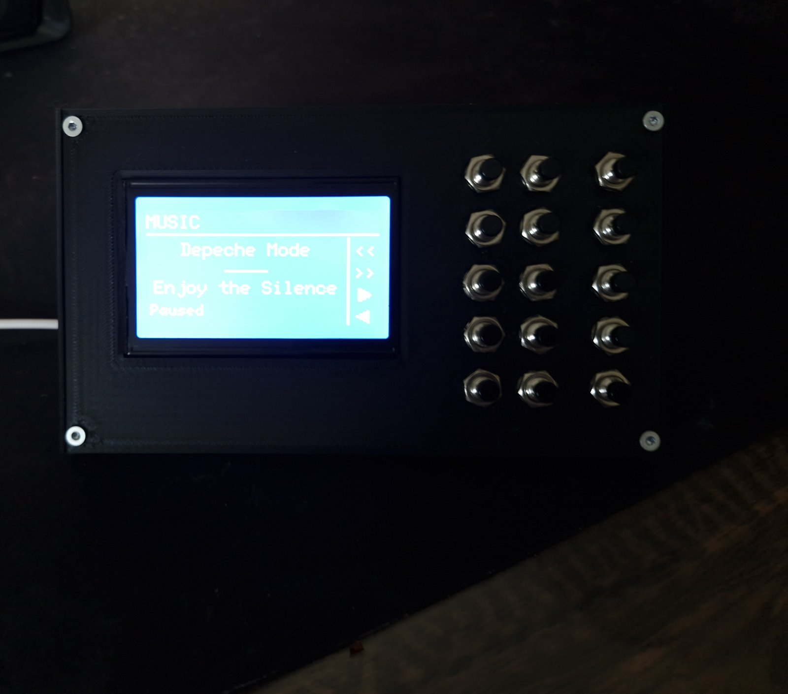
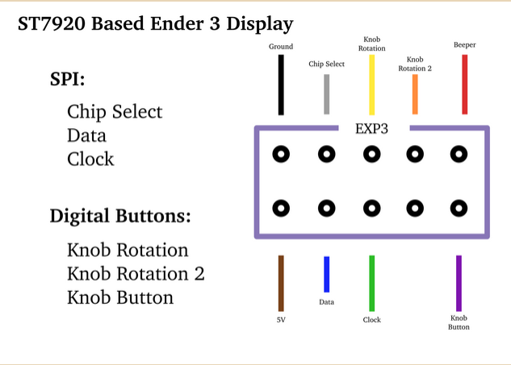
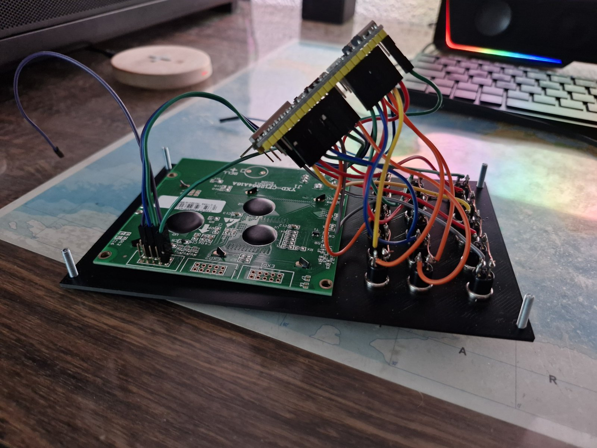
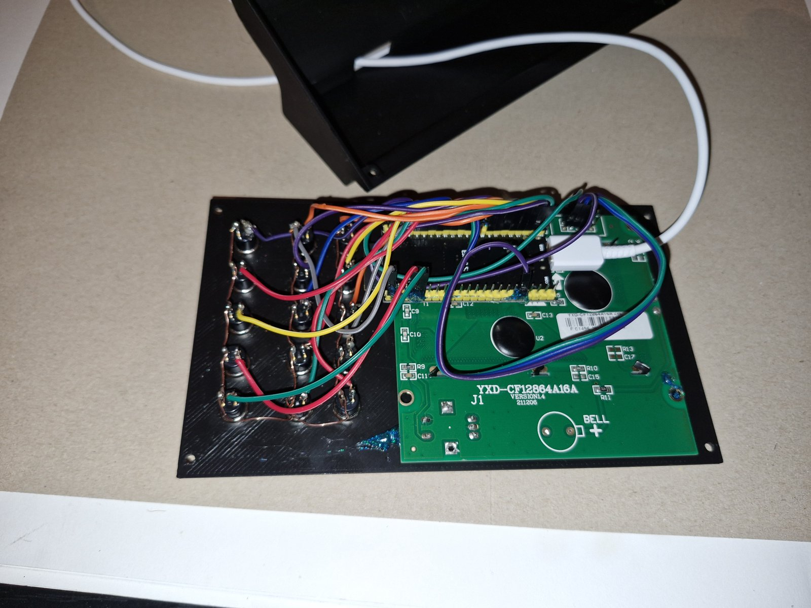

# Build guide

This button box reuses the graphic LCD from an **old Ender 3 / CR‑10** (the stock
"full graphic smart controller" — a 128×64 **ST7920** panel) plus a handful of
**cheap mini push buttons**, driven by an ESP32‑S3. It enumerates as a plain USB
gamepad, so it needs no drivers, and a small Windows companion app adds live PC
stats, media control, and configuration.

## You don't have to build anything from source

Prebuilt artifacts are on the project's **Releases** page — you can skip the
toolchains entirely:

- **`firmware.bin`** — flash it straight to the ESP32‑S3 (see [Flashing](#flashing-the-firmware)).
  No PlatformIO / Arduino install needed.
- **`ButtonboxCompanion.exe`** — the Windows companion app. Just run it; no Python needed.

Building from source is only necessary if you want to change the firmware or the app.

## Bill of materials

| Qty | Part | Notes |
|----:|------|-------|
| 1 | ESP32‑S3 **N16R8 DevKitC‑1** | 16 MB flash / 8 MB PSRAM. Any ESP32‑S3 devkit with native USB works. |
| 1 | 128×64 **ST7920** "12864" graphic LCD | The **Ender 3 / CR‑10 stock display** (RepRapDiscount full graphic smart controller). Salvage one, or buy a 12864 module. |
| 15 | Mini push buttons | e.g. [roboter‑bausatz mini push button](https://www.roboter-bausatz.de/p/schwarzer-mini-push-button). |
| — | Hook‑up / Dupont wire | For the button and display wiring. |
| 1 | USB‑C cable (data) | To the ESP32‑S3. |
| 4 | M3 screws | Hold the lid to the case (corners). |
| — | 3D‑printed **Case** + **Lid** | See below. |

The 15 buttons break down as **10 main** + **4 nav** + **1 menu/mode** button.

> **ESP32-S3 board notes:**
> - Use the port labeled **USB** (the native USB), **not COM** (the UART bridge) — the
>   box only enumerates as a USB gamepad over the native USB port.
> - On **clone** boards, bridge the **IN-OUT** solder pads so the USB port's 5V is
>   routed to the board's **5V** pin — that's what powers the screen. (Genuine
>   Espressif boards already have this connected.)

## 3D‑printed parts

STEP files are in [`3d_models/`](../3d_models):

- [Case.step](../3d_models/Case.step) — the body that covers the wiring
- [Lid.step](../3d_models/Lid.step) — the front cover containing the screen and buttons

### Two mounting orientations

The box works **either way up** — display‑left / buttons‑right, or
display‑right / buttons‑left — so you can mount it to suit your desk. The
firmware's **Rotate** setting flips the screen 180° *and* moves the on‑screen
button hints to the matching side. Set it once to match how you mounted it:

- on‑device: **Menu → Settings → Rotate**, or
- in the companion's **Device** tab → *Rotate*.

### Removing the embossed text

The part has text embossed on it. To print without it, remove it in your slicer:
import the STEP, **split it into parts/objects**, select the **text body**, and
delete it before slicing.

- PrusaSlicer / Bambu Studio / OrcaSlicer: right‑click the object → *Split to objects/parts*
- Cura: *Split model into parts*

The rest of the part is unaffected.

## Preparing the salvaged screen

These 12864 panels come as a full controller board with a **rotary encoder**, a
**buzzer/speaker** (the "BELL +" pad visible in the soldered photo), an SD slot and
a reset button. This build uses only the LCD, so **desolder the rotary encoder and
the buzzer** — they're unused and the encoder sticks out the front, so removing it
lets the panel sit flush in the lid.

I went the separate‑push‑button route on purpose: the encoder on my salvaged
screen was **dead**, and that's common — these displays often sit in a drawer for
years after a printer upgrade, and the encoder (or its solder joints / contacts)
degrades. Driving the ST7920 LCD directly and adding cheap new buttons sidesteps a
part that's likely broken anyway.

## Wiring / pinout

Every button is wired the same trivial way: **one leg to a GPIO, the other leg to
GND**. The firmware enables the ESP32's internal pull‑ups, so **no resistors are
needed**. All the button grounds can share a single daisy‑chained GND wire (see
the soldered photo below).

### Display (ST7920, software SPI)

| ESP32‑S3 | Display pin |
|----------|-------------|
| GPIO **17** | **Clock** (ST7920 E) |
| GPIO **18** | **Data** (ST7920 R/W / MOSI) |
| GPIO **21** | **Chip Select** (ST7920 RS) |
| **5V** | **5V** |
| **GND** | **Ground** |

On the Ender 3 / CR‑10 12864 these signals come out on the **EXP3** ribbon and the
panel PCB is labeled (E / RW / RS). It runs in ST7920 *serial* mode (the PSB pin
tied low — already handled on the RepRapDiscount board).

The diagram below — an **ST7920-based Ender 3 display** (EXP3 connector) — labels
the lines by function, which makes wiring obvious:

Connect **Ground** and **5V** to the ESP's GND/5V, and the three SPI lines to the
GPIOs in the table above: **Clock -> GPIO 17**, **Data -> GPIO 18**,
**Chip Select -> GPIO 21**. The remaining pins (Knob Rotation x2, Knob Button,
Beeper) drove the original encoder and buzzer and aren't used here.

*Connector pinout diagram from [maddie.info](https://maddie.info/hardware/2023/07/01/ender3-exp3-pinout.html).*

### Buttons

| ESP32‑S3 GPIO | Role |
|---------------|------|
| **2** | Menu / Mode button (not a HID button) |
| **1** | Nav — Up |
| **5** | Nav — Down |
| **6** | Nav — Select |
| **4** | Nav — Back |
| **7, 8, 9, 10, 11, 12, 13, 14, 15, 16** | Main HID buttons 1–10 |

The 4 nav buttons double as HID buttons 11–14 in normal mode; the **menu/mode**
button switches those four between gamepad buttons and on‑screen menu navigation.
The full pin map lives in [`src/config.h`](../src/config.h) if you want to rewire.

## Assembly

| Jumpered (test first) | Soldered (tidy) |
|---|---|
|  |  |

1. Print both parts (remove the embossed text first if you want it gone).
2. Desolder the encoder + buzzer from the screen (see above), then mount the 15 push buttons and the LCD into the **Lid** (the front).
3. Wire each button: signal leg → its GPIO (table above), other leg → the shared GND chain.
4. Wire the display's five lines to the ESP (table above).
5. Set the ESP into the **Case** (the back body), join it to the Lid, screw the corners, and plug in USB.

Tip: build the messy jumper‑wire version first and confirm every button and the
screen work, *then* solder it tidy.

## Flashing the firmware

**Prebuilt (recommended):** download `firmware.bin` (a full, merged flash image)
from the Releases page and write it at offset **0x0**:

- Browser flasher — open <https://espressif.github.io/esptool-js/>, connect, set
  offset `0x0`, choose `firmware.bin`, **Program**.
- Or esptool — `esptool --chip esp32s3 write_flash 0x0 firmware.bin`

To put a running box into download mode: use the companion's **Flash Mode** button,
or hold **BOOT** on the devkit while tapping **RESET**, then release BOOT.

**From source:** with [PlatformIO](https://platformio.org) installed, `pio run -t upload`
(see the main [README](../README.md)).

## Companion app (optional)

The Windows companion streams PC stats to the box, drives the **Music** page
(now‑playing title + transport control), and edits the box's settings and chords
live. Use the prebuilt `ButtonboxCompanion.exe`, or run it from source — see
[`host/README.md`](../host/README.md).
